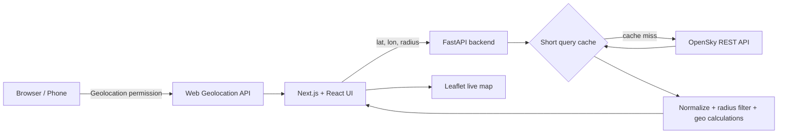

<div align="center">

# SkyAbove

### Live aircraft around you, visualized in real time.

**A privacy-conscious, open-source aircraft tracker that combines browser geolocation with live OpenSky state vectors to show the traffic moving around your position.**

[](https://github.com/othmanayari049-wq/SkyAbove/actions/workflows/ci.yml)
[](LICENSE)
[](https://nextjs.org/)
[](https://fastapi.tiangolo.com/)
[](https://opensky-network.org/)

</div>

---

## What is SkyAbove?

SkyAbove answers a simple question: **"What aircraft are flying around me right now?"**

Allow location access and the app automatically determines your position, requests a geographically bounded slice of live air-traffic state data, calculates the distance and bearing of each aircraft, and renders the results on an interactive radar-style map.

SkyAbove is designed as an educational/open-source project, not an air-traffic-control or safety system.

## Highlights

- Automatic browser geolocation — no latitude/longitude entry required.
- Live nearby-aircraft map with heading-aware plane markers.
- 25 km, 50 km, 100 km, and 200 km search radii.
- Distance rings centered on your position.
- Closest-aircraft / overhead-candidate card.
- Callsign, ICAO24, country, altitude, speed, heading, vertical rate, squawk, category, and position source when available.
- Selected-aircraft track trail built from live browser updates.
- Responsive desktop/mobile interface.
- Privacy-conscious architecture with no user-location database or analytics SDK.
- OpenSky anonymous mode works without credentials.
- Optional OpenSky OAuth2 client-credentials support.
- API-side short cache to reduce wasted OpenSky credits.
- FastAPI Swagger/OpenAPI docs.
- Docker and Docker Compose support.
- Automated frontend and backend checks with GitHub Actions.

## Architecture



The backend proxies OpenSky instead of calling it directly from the browser. This keeps optional OAuth credentials server-side, centralizes rate-limit handling, validates query bounds, filters the rectangular upstream result into a true circular radius, and gives the frontend one stable API contract.

## Tech stack

| Layer | Technology | Purpose |
|---|---|---|
| Frontend | Next.js, React, TypeScript | UI, state, geolocation, polling |
| Map | Leaflet, React Leaflet, OpenStreetMap tiles | Interactive aircraft visualization |
| Backend | Python, FastAPI, Pydantic, HTTPX | OpenSky integration and geospatial processing |
| Quality | ESLint, Ruff, Pytest | Static checks and tests |
| DevOps | Docker, Docker Compose, GitHub Actions | Reproducible execution and CI |

## Quick start with Docker

```bash
git clone https://github.com/othmanayari049-wq/SkyAbove.git
cd SkyAbove
cp .env.example .env
docker compose up --build
```

Open `http://localhost:3000` for the web UI and `http://localhost:8000/docs` for API documentation.

OpenSky credentials are optional. Leave them empty to use anonymous access.

## OpenSky authentication

For authenticated access create an API client in your OpenSky account and add:

```dotenv
OPENSKY_CLIENT_ID=your_client_id
OPENSKY_CLIENT_SECRET=your_client_secret
```

The backend uses OAuth2 client credentials, caches the token until shortly before expiry, and retries once with a fresh token after an authenticated `401`.

Never expose `OPENSKY_CLIENT_SECRET` through a `NEXT_PUBLIC_*` variable or commit it to Git.

## Local development

### Backend

```bash
cd backend
python -m venv .venv
# Windows: .venv\Scripts\activate
# macOS/Linux: source .venv/bin/activate
pip install -e ".[dev]"
uvicorn app.main:app --reload --port 8000
```

### Frontend

```bash
cd frontend
npm install
cp .env.local.example .env.local
npm run dev
```

## Testing

```bash
cd backend
ruff check .
pytest -q

cd ../frontend
npm run lint
npm run typecheck
npm run build
```

The frontend defaults to a 30-second poll interval to balance live updates with OpenSky credit usage. Deployments can tune `NEXT_PUBLIC_POLL_INTERVAL_MS` (minimum 10 seconds in the client).

## Data and accuracy limitations

SkyAbove can only display aircraft represented in the upstream data it receives. Receiver coverage, transponder availability, rate limits, and missing state-vector fields can affect what appears. An **overhead candidate** is simply an airborne aircraft within the configured horizontal-distance threshold; it is not a claim that the aircraft is exactly vertically above the device.

SkyAbove is **not** suitable for navigation, collision avoidance, dispatch, emergency response, surveillance decisions, or any safety-critical use. Data can be delayed, incomplete, unavailable, or inaccurate.

OpenSky describes its live API as intended for research/non-commercial use and applies API-credit limits. Review its current terms before public or commercial deployment.

## Privacy

- Browser controls location permission.
- SkyAbove has no user account system.
- No analytics SDK is included.
- No application database stores device locations.
- Coordinates are sent only to the configured SkyAbove backend when requesting nearby aircraft.

A deployment operator can modify this behavior, so users should review the policy of any third-party hosted instance.

## Roadmap

- Device-compass **Look Up** mode.
- Installable PWA shell.
- Persisted flight-history trails.
- Airport/runway overlays.
- Alternative ADS-B provider adapters.
- Aircraft metadata enrichment from a separately licensed source.
- Accessibility audit and keyboard-first map controls.
- Internationalization.

## Contributing

Contributions are welcome. Read [`CONTRIBUTING.md`](CONTRIBUTING.md), create a focused branch, add tests where appropriate, and open a pull request.

## Attribution

Aircraft state data: **The OpenSky Network**. Base map data: **© OpenStreetMap contributors**.

## License

SkyAbove source code is released under the [MIT License](LICENSE). Third-party data and map services remain subject to their own licenses and terms.
