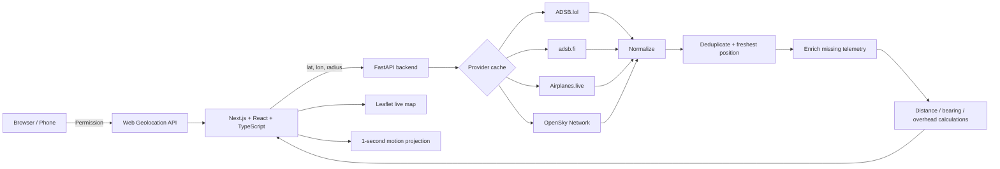

<div align="center">

# ✈️ SkyAbove

### Live aircraft around you — mapped, fused, and visualized in real time.

**SkyAbove is a privacy-conscious open-source aircraft tracker that combines browser geolocation, multiple live aircraft-data providers, geospatial calculations, and smooth motion projection to show what is flying around you right now.**

[](https://github.com/othmanayari049-wq/SkyAbove/actions/workflows/ci.yml)
[](LICENSE)
[](https://nextjs.org/)
[](https://fastapi.tiangolo.com/)
[](https://www.typescriptlang.org/)
[](https://www.python.org/)
[](#aircraft-data-sources)

</div>

---

## What is SkyAbove?

SkyAbove answers one simple question:

> **What aircraft are flying around me right now?**

Allow location access and SkyAbove automatically determines your position, requests nearby aircraft from configured live-data providers, normalizes and fuses the responses, removes duplicates, calculates distance and bearing, and renders the aircraft on an interactive radar-style map.

It is built as an engineering and educational project — **not** as an air-traffic-control, navigation, dispatch, or safety system.

---

## Highlights

- 📍 Automatic browser geolocation — no manual latitude/longitude entry required.
- 🛰️ Multi-provider aircraft-data fusion.
- ✈️ Heading-aware aircraft markers using true track.
- 🎯 25 km, 50 km, 100 km, and 200 km search radii.
- 🧭 Distance and true initial-bearing calculations.
- 📡 ADS-B / MLAT / ADS-C / other source labels when available.
- 🛫 Callsign, ICAO24, altitude, speed, track, vertical rate, squawk, category, and source metadata when reported.
- 🧠 Deduplication by ICAO24 with freshest-position preference.
- 🧩 Missing telemetry can be filled from another provider when the same aircraft is reported by multiple sources.
- 🌀 Smooth one-second visual motion between upstream position refreshes.
- 🧵 Selected-aircraft trail history in the browser.
- 📱 Responsive desktop and mobile interface.
- 🔒 No SkyAbove user-location database and no analytics SDK.
- 🐳 Docker + Docker Compose support.
- 🧪 Pytest, Ruff, ESLint, TypeScript checks, and production builds in GitHub Actions.
- 📚 FastAPI-generated Swagger/OpenAPI documentation.

---

## Architecture



The backend is intentionally placed between the browser and upstream providers. It gives the frontend a single stable contract, keeps credentials server-side, handles provider-specific response formats, applies caching, normalizes units, fuses duplicate aircraft, and prevents provider-specific logic from leaking into the UI.

---

## Tech stack

| Layer | Technology | Purpose |
|---|---|---|
| Frontend | Next.js, React, TypeScript | UI, geolocation, state, polling, motion projection |
| Map | Leaflet, React Leaflet, OpenStreetMap | Interactive aircraft visualization |
| Backend | Python, FastAPI, Pydantic, HTTPX | Provider adapters, fusion, validation, geospatial processing |
| Data | ADSB.lol, adsb.fi, Airplanes.live, OpenSky | Free live aircraft sources with different coverage footprints |
| Quality | ESLint, TypeScript, Ruff, Pytest | Static analysis and automated validation |
| DevOps | Docker, Docker Compose, GitHub Actions, Dependabot | Reproducible execution, CI, maintenance |

---

# Aircraft data sources

SkyAbove currently ships with a **free multi-provider fusion layer**.

| Provider | Cost | Built in | Notes |
|---|---:|:---:|---|
| [ADSB.lol](https://adsb.lol/) | Free | ✅ | Community/open ADS-B network |
| [adsb.fi](https://adsb.fi/) | Free | ✅ | Community-supported open aircraft data |
| [Airplanes.live](https://airplanes.live/) | Free | ✅ | Public nearby-aircraft API |
| [OpenSky Network](https://opensky-network.org/) | Free / limited | ✅ | Research-oriented air-traffic network; anonymous and OAuth access supported |

SkyAbove queries the configured sources, normalizes their results, and fuses matching ICAO24 aircraft instead of simply stopping at the first provider that returns data.

### Important: free coverage is not guaranteed

These services are largely built from distributed receiver networks. Coverage therefore varies by geography, receiver density, aircraft transmission method, provider policy, and time.

**A commercial tracker may show many aircraft while every free SkyAbove provider returns zero aircraft for the same area.** In that case the map is not necessarily broken — the upstream free networks may simply not have usable live positions for that location at that moment.

For broader or more predictable coverage, use a licensed commercial aircraft-data API.

---

# Recommended paid aircraft APIs

> [!IMPORTANT]
> Paid providers are **optional upgrade paths**. The default SkyAbove release currently ships with the free providers above. A paid-provider adapter must be enabled/implemented before its key affects aircraft results. Never paste a paid API secret into frontend code.

## Option 1 — ADS-B Exchange Community API

**Best fit for personal / non-commercial SkyAbove deployments.**

Official developer page: [ADS-B Exchange Developer Hub](https://www.adsbexchange.com/community/developer-hub/)

At the time this README was updated, ADS-B Exchange advertises its Community API at **$10/month**, including:

- 10,000 requests;
- real-time aircraft position data;
- advertised updates as fast as 500 ms;
- location, ICAO/hex, callsign, and squawk queries;
- global ADS-B Exchange network coverage;
- API-key access through RapidAPI.

Pricing, quotas, licensing, and terms can change. **Always verify the current official Developer Hub before subscribing.** Commercial use requires the appropriate commercial/enterprise license.

### Where to put the ADS-B Exchange key

Keep it **server-side** in the project-root `.env` file:

```dotenv
# Optional paid provider — requires an ADS-B Exchange adapter/configuration
ADSBX_API_KEY=your_api_key_here
```

Do **not** use:

```dotenv
NEXT_PUBLIC_ADSBX_API_KEY=...
```

Anything beginning with `NEXT_PUBLIC_` is bundled for browser access and must be treated as public.

---

## Option 2 — Flightradar24 API

**Strong option when you want a commercial flight-data product with broad live-position coverage and additional flight metadata.**

Official API site: [Flightradar24 API](https://fr24api.flightradar24.com/)

Official pricing: [Subscriptions & credits](https://fr24api.flightradar24.com/subscriptions-and-credits)

At the time this README was updated, the entry **Explorer** API plan is advertised at **$9/month**. Flightradar24's `Live flight positions - light` endpoint is available on its API subscription plans and provides live movement information such as latitude, longitude, speed, and altitude.

Flightradar24 uses a **credit-based model**, where usage depends on the endpoint and returned entities. Review the current official credit documentation before choosing a refresh rate for a map application.

### Where to put the Flightradar24 token

Store it in the project-root `.env` file, never in the browser bundle:

```dotenv
# Optional paid provider — requires an FR24 adapter/configuration
FR24_API_TOKEN=your_api_token_here
```

Again, **do not** prefix this secret with `NEXT_PUBLIC_`.

---

## Which paid provider should I choose?

| Requirement | Suggested option |
|---|---|
| Personal aircraft-tracking project | **ADS-B Exchange Community API** |
| Dense ADS-B-oriented map | **ADS-B Exchange** |
| Commercial flight-data ecosystem | **Flightradar24 API** |
| Rich flight/route metadata | **Flightradar24 API** |
| No monthly cost | Keep the built-in free fusion providers |

The paid services have independent terms and licenses. A subscription does not automatically grant permission to redistribute raw data publicly or commercially.

---

# Secrets and `.env` configuration

SkyAbove uses environment variables for backend configuration and secrets.

Create your local file from the template:

### Windows PowerShell

```powershell
Copy-Item .env.example .env
```

### macOS / Linux

```bash
cp .env.example .env
```

Then edit `.env` locally.

A typical configuration looks like:

```dotenv
# Free providers included in SkyAbove
AIRCRAFT_PROVIDERS=adsblol,adsbfi,airplaneslive,opensky

# Optional OpenSky OAuth
OPENSKY_CLIENT_ID=
OPENSKY_CLIENT_SECRET=

# Optional paid-provider secrets
# These require the corresponding adapter/configuration before they are used.
ADSBX_API_KEY=
FR24_API_TOKEN=

# Frontend refresh interval
NEXT_PUBLIC_POLL_INTERVAL_MS=10000
```

### Never commit secrets

Your real `.env` must remain local and ignored by Git.

Safe:

```text
.env.example       ← public placeholders
.env               ← your private values, not committed
```

Unsafe:

```text
README.md          ← never paste a real API key here
frontend source    ← never hard-code a secret here
NEXT_PUBLIC_*      ← never use this prefix for private credentials
GitHub issue/PR    ← never paste credentials into screenshots or logs
```

For hosted deployments, use the hosting platform's encrypted environment-variable / secret-management interface rather than committing `.env`.

---

# Quick start with Docker

## 1. Clone

```bash
git clone https://github.com/othmanayari049-wq/SkyAbove.git
cd SkyAbove
```

## 2. Create `.env`

### Windows PowerShell

```powershell
Copy-Item .env.example .env
```

### macOS / Linux

```bash
cp .env.example .env
```

## 3. Start SkyAbove

```bash
docker compose up --build
```

Open:

- Web UI: `http://localhost:3000`
- API docs: `http://localhost:8000/docs`
- Health endpoint: `http://localhost:8000/health`

Allow browser location access when requested.

---

# OpenSky authentication

OpenSky credentials are optional.

Anonymous access can work without credentials, subject to OpenSky's current restrictions and limits. For authenticated access, create an API client in your OpenSky account and add:

```dotenv
OPENSKY_CLIENT_ID=your_client_id
OPENSKY_CLIENT_SECRET=your_client_secret
```

The backend uses OAuth2 client credentials, caches the access token until shortly before expiration, and can refresh after an authentication failure.

Never expose `OPENSKY_CLIENT_SECRET` through a `NEXT_PUBLIC_*` variable.

---

# Live motion model

Aircraft-data APIs do not necessarily push a new geographic coordinate every browser animation frame. SkyAbove therefore separates **source updates** from **visual motion**.

1. The browser periodically requests fresh aircraft states.
2. The backend fuses and returns the freshest available observations.
3. Between source refreshes, the frontend projects an airborne aircraft forward using its reported ground speed and true track.
4. Projection is time-limited so stale positions are not extrapolated indefinitely.
5. A new real observation replaces the projected position on the next refresh.

This creates smoother movement while preserving the distinction between **reported positions** and **short-term visual projection**.

SkyAbove must not be used where predicted/extrapolated positions could create a safety risk.

---

# Troubleshooting

## The map works but shows `0 aircraft`

First verify the backend:

```text
http://localhost:8000/health
```

Then test a nearby query:

```text
http://localhost:8000/api/v1/aircraft/nearby?lat=21.5433&lon=39.1728&radius_km=200
```

Inspect:

```json
{
  "data_provider": "...",
  "count": 0,
  "aircraft": []
}
```

A `200 OK` response with `count: 0` means the application completed the request successfully but the configured upstream data sources did not provide usable aircraft inside the requested radius.

Things to check:

1. Increase the radius to 200 km.
2. Wait for another live refresh.
3. Confirm browser geolocation is correct.
4. Confirm the backend is not reporting provider errors.
5. Test providers directly if debugging coverage.
6. Remember that receiver-based free networks can have geographic gaps.
7. Consider a licensed paid provider when consistent regional coverage is required.

## Docker starts but `docker` cannot connect

Make sure Docker Desktop is running and the engine is active:

```powershell
docker info
```

Then:

```powershell
docker compose up --build
```

## Hard-refresh after rebuilding the frontend

Windows/Linux browsers:

```text
Ctrl + F5
```

---

# Local development

## Backend

```bash
cd backend
python -m venv .venv

# Windows
.venv\Scripts\activate

# macOS/Linux
source .venv/bin/activate

pip install -e ".[dev]"
uvicorn app.main:app --reload --port 8000
```

## Frontend

```bash
cd frontend
npm install
cp .env.local.example .env.local
npm run dev
```

---

# Testing

## Backend

```bash
cd backend
ruff check .
pytest -q
```

## Frontend

```bash
cd frontend
npm run lint
npm run typecheck
npm run build
```

GitHub Actions runs the same quality gates against repository changes.

---

# Data and accuracy limitations

SkyAbove can only display aircraft represented in the upstream data it receives.

Coverage and quality may be affected by:

- receiver density;
- geography and terrain;
- aircraft transmission technology;
- ADS-B / MLAT / ADS-C availability;
- provider filtering or policy;
- API quotas and rate limits;
- stale or missing coordinates;
- missing callsign/altitude/speed fields;
- network outages;
- temporary upstream failures.

An **overhead candidate** is an airborne aircraft within the configured horizontal-distance threshold. It does not prove that an aircraft is exactly vertically above the device.

SkyAbove is **not suitable for navigation, collision avoidance, dispatch, emergency response, surveillance decisions, or any other safety-critical use**.

---

# Privacy

- Browser controls location permission.
- SkyAbove has no user-account system.
- No analytics SDK is included.
- No application database stores device locations.
- Coordinates are sent to the configured SkyAbove backend only for nearby-aircraft requests.
- Paid-provider credentials belong on the backend and are never required by the browser.

A deployment operator can change the application, so users should review the privacy policy of any third-party hosted instance.

---

# Security

- Never commit `.env`.
- Never expose secrets using `NEXT_PUBLIC_*`.
- Rotate any key accidentally committed to Git immediately.
- Use provider-specific quotas/rate limits.
- Prefer server-side proxying over direct browser access to paid aircraft APIs.
- Review [`SECURITY.md`](SECURITY.md) before reporting a vulnerability.

---

# Roadmap

- [ ] ADS-B Exchange Community API adapter.
- [ ] Flightradar24 API adapter.
- [ ] Per-provider diagnostics and coverage statistics.
- [ ] Device-compass **Look Up** mode.
- [ ] Installable PWA shell.
- [ ] WebSocket / streaming provider support where licensed.
- [ ] Persisted flight-history trails.
- [ ] Airport and runway overlays.
- [ ] Aircraft metadata enrichment from separately licensed sources.
- [ ] Local RTL-SDR / `readsb` receiver mode.
- [ ] Accessibility audit and keyboard-first map controls.
- [ ] Internationalization.

---

# Contributing

Contributions are welcome.

Read [`CONTRIBUTING.md`](CONTRIBUTING.md), create a focused branch, add tests where appropriate, and open a pull request.

A particularly useful contribution is a clean provider adapter that conforms to SkyAbove's normalized aircraft model without leaking credentials to the frontend.

---

# Attribution

Current built-in aircraft sources include:

- [ADSB.lol](https://adsb.lol/)
- [adsb.fi](https://adsb.fi/)
- [Airplanes.live](https://airplanes.live/)
- [OpenSky Network](https://opensky-network.org/)

Map data: **© OpenStreetMap contributors**.

Optional commercial providers such as ADS-B Exchange and Flightradar24 remain subject to their own subscriptions, API terms, attribution requirements, redistribution restrictions, and licenses.

---

# License

SkyAbove source code is released under the [MIT License](LICENSE).

The MIT license covers **SkyAbove source code only**. Aircraft data, map tiles, provider SDKs, API responses, logos, trademarks, and third-party services remain subject to their respective owners' licenses and terms.

---

<div align="center">

### Built to make the airspace above you understandable.

**SkyAbove** · Open source · Real-time aviation visualization

</div>
